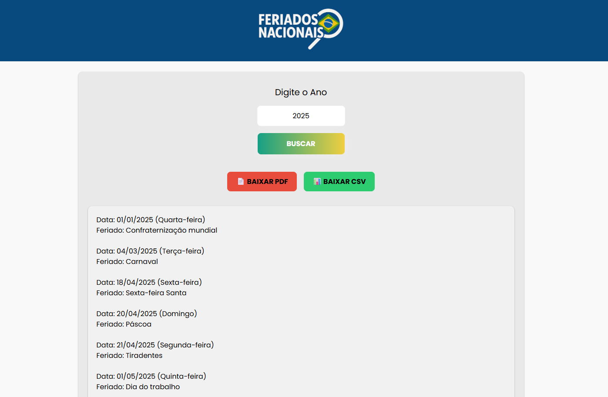

## 🏋️‍♂️ Projeto HTML + CSS + Javascript.

Página para busca de endereço por meio do CEP, utilizando a API viaCEP.   

Os temas abordados são: 
- Consumo de APIs.
- Requisição HTTP assíncrona.
- Conversão de Dados.
- Tratamento de Erros. 

## Funcionalidades:

- Pesquisa do CEP.
- Botão para limpar o resultado e o valor digitado.

## Estrutura do Projeto:

- index.html: Arquivo HTML principal.
- assets/css/styles.css: Arquivo CSS para estilização.
- assets/js/script.js: Arquivo JavaScript contendo as funcionalidades descritas acima.

## 💻 Tecnologias utilizadas nesse projeto:

  
  
  

## 💻 Preview:

- Veja como ficou o projeto acessando: [Link](https://javascript-css-busca-cep.vercel.app/)
  

## 📌 Referências:
- **Site:** ✨ViaCEP:
  [https://viacep.com.br/](https://viacep.com.br/)

- **Site:** ✨Medium:
  [Usando API de consulta de endereço](https://medium.com/@braulliovg/consumindo-api-de-consulta-de-endere%C3%A7o-via-javascript-c83b7ad9976e)

